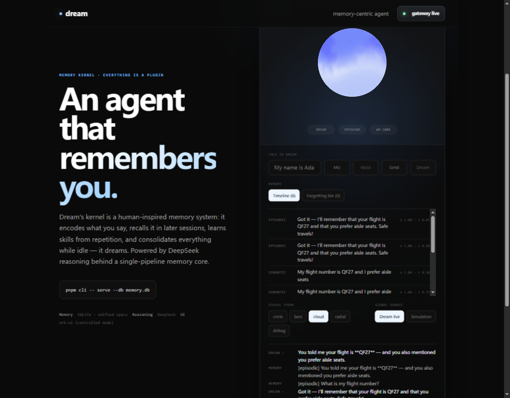

**English** | [中文](README.zh-CN.md)

# Dream

**A memory-centric agent.** Dream's kernel is a human-inspired memory system —
a unified memory space with a full lifecycle (encode → consolidate → retrieve
→ reconsolidate → forget). Everything else — the reasoning model, tools, voice,
UI — is a swappable plugin.

> Everything is a plugin, **except memory**. Memory defines who the agent is.



## The problem with every other agent

Every mainstream agent restarts life at every session: one conversation, one
memory, a fresh persona each time. Prompt, vector store, window — and when the
window closes, everything the agent learned is either gone or a dead row in a
retrieval index. It never gets faster at your recurring tasks, never revises a
belief, never forgets anything on purpose.

Dream inverts the architecture. The reasoning loop is not the core; **memory
is**. The model is rented and replaceable; memory is what makes Dream the same
entity across sessions, days, and model upgrades.

## What that buys you

| | Typical agent | Dream |
| --- | --- | --- |
| **Memory** | per-session context + retrieval | one unified space; a session is an activation pattern, not a container |
| **Learning** | fine-tuning or prompt edits | the memory lifecycle *is* the learning loop |
| **Skills** | static instruction files, read every time | procedural memory: induced from repeated work, parameter-slotted, replayed **with zero LLM calls** |
| **Corrections** | stale beliefs persist | recall opens a reconsolidation window; user corrections rewrite in place (version bump, evidence-priority ladder) |
| **Forgetting** | everything kept forever | calibrated adaptive decay (τ=90d measured); the forgetting bin can still revive a fading memory |
| **Idle time** | nothing happens | Dream *dreams*: consolidation replays episodes, abstracts patterns, merges duplicates, induces skills, re-strengthens what matters |
| **Safety** | model self-discipline | one pipeline for every tool call (incl. MCP), deny-by-default plugin capabilities, fail-closed approvals, secret scrubbing on write *and* read, tombstone audit |

## Evidence, not vibes

Most agent projects ship demos. Dream ships an **experiment suite** — six
controlled, deterministic experiments (`pnpm experiments` → `EXPERIMENTS.md`)
that have already found and fixed real bugs:

| # | experiment | headline result |
| --- | --- | --- |
| E1 | recall scaling × embedding ablation | 100% recall@4 at 400 same-template nodes; the "embeddings degrade" hypothesis was **falsified**; profiling exposed a 10× store bottleneck |
| E2 | consolidation (dream) efficacy | pattern queries 30 days later: abstraction ranked #1 in **3/3** themes (was 0/3 — the experiment drove centroid embeddings, a retrievability gate, and stemming) |
| E3 | forgetting calibration | τ sweep found a **quadratic-compounding decay bug**; calibration set the default τ=90d; replay-strengthens implemented from the data |
| E4 | skill parameter drift | frozen-arg replay silently used the **wrong dataset 6/6** times; slot mining + fail-closed binding brought that to **0/6** |
| E5 | reconsolidation windows | exact from 1 min to 24 h; priority ladder holds under collision |
| E6 | context budget growth | 400 stored memories add only ~160 prompt tokens — bounded context, verified against live API `usage.prompt_tokens` |

The suite runs offline in under two minutes with no API keys.

## Try it

```bash
git clone <this repo> && cd dream
pnpm install

pnpm test          # 70 unit tests
pnpm eval          # 4 functional eval suites (offline, deterministic)
pnpm experiments   # the six experiments → EXPERIMENTS.md

# 1) Offline chat demo — no API key, full memory loop with scripted replies
pnpm demo
#   you › My name is Ada and I live in Seattle
#   you › What is my name?
#   dream › I remember: My name is Ada and I live in Seattle
#   /dream  → run a consolidation cycle and print the dream report

# 2) The real thing: live web app + DeepSeek reasoning + persistent memory
pnpm cli -- serve --db memory.db --idle-dream 300   # gateway on ws://127.0.0.1:7333
pnpm --filter @dream/web dev                        # → http://localhost:5180
```

In the web app: switch **Signal source → Dream live**, say things like *"my
flight is QF27 and I prefer aisle seats"*, ask them back in new sessions, open
**Timeline** to watch memories encode with strength/importance, leave it idle
for five minutes and watch it dream. Talk to it with the **Mic** button
(browser speech, zero setup), or have it talk back with **Voice**.

Configuration via `.env` (see [`.env.example`](.env.example)):

```bash
DREAM_API_KEY=sk-...                  # any OpenAI-compatible chat provider
DREAM_BASE_URL=https://api.deepseek.com/v1
DREAM_MODEL=deepseek-chat
DREAM_EMBED_MODEL=text-embedding-3-small   # optional real embeddings
DREAM_MCP_CONFIG=mcp-servers.json          # optional MCP servers (stdio)
```

## How it works

```plaintext
┌──────────────────────────────────────────────────────────────┐
│  orb-ui interface  —  orb = working-memory gauge;            │
│  memory timeline · forgetting bin · dream report · voice     │
└──────────────────────────┬───────────────────────────────────┘
                           │  WebSocket (cognitive state stream)
┌──────────────────────────▼───────────────────────────────────┐
│  plugins (single pipeline, deny-by-default capabilities)     │
│  perception · reasoning (DeepSeek et al.) · tools (MCP)      │
│  voice · policies · dream passes                             │
└──────────────────────────┬───────────────────────────────────┘
                           │  the only exchange medium:
┌──────────────────────────▼───────────────────────────────────┐
│  DREAMCORE — the privileged memory kernel                    │
│  working memory (4±1 chunks = the cognitive bus)             │
│  unified LTM: episodic · semantic · procedural · self        │
│  lifecycle engine = learning engine                          │
│  append-only journal (tombstone audit)                       │
└──────────────────────────────────────────────────────────────┘
```

The full design — activation math, consolidation passes, skill binding,
safety invariants — is in [ARCHITECTURE.md](ARCHITECTURE.md) and
[SAFETY.md](SAFETY.md).

## Packages

| package | role |
| --- | --- |
| `@dream/core` | memory kernel: node model, stores, working-memory bus, spreading activation, encoding gate, lifecycle engine, skill binding, self-model |
| `@dream/kernel` | orchestration: plugin host, capability enforcement, single pipeline, executive session runner |
| `@dream/policies` | deny-by-default presets, fail-closed approvals, secret scrubbing, injection quarantine |
| `@dream/store-sqlite` | libSQL persistence — local-first: one file you own |
| `@dream/plugin-reasoning-openai` | OpenAI-compatible reasoning strategy |
| `@dream/plugin-mcp` | stdio MCP bridge — MCP tools through the same pipeline |
| `@dream/plugin-scripted` | deterministic reasoning + mock tools (tests, evals, demo) |
| `@dream/eval` | the measuring stick: eval suites + the experiment harness |
| `@dream/web` | orb-ui interface, memory panels, voice v1 |
| `@dream/cli` | `dream chat / serve / dream / stats / eval / experiments` |

## Status & roadmap

v0.1.0 — working skeleton through P4 of the original roadmap. Verified: 70
unit tests, 4/4 eval suites, experiments 5×WORKS + 1×PARTIAL, typecheck clean,
live browser sessions with DeepSeek.

- 🔜 Multi-user memory scoping (per-user partitions, isolation tests)
- 🔜 Streaming voice adapters (Pipecat / OpenAI Realtime via orb-ui adapters)
- 🔜 `sqlite-vec` index beyond ~10⁴ nodes; LLM-based abstraction & importance passes
- 🔜 Plugin SDK & manifest format aligned with the dsh ecosystem

Known limits are documented honestly in [ARCHITECTURE.md §8](ARCHITECTURE.md)
(parametric-vs-external memory conflict, credit assignment v1, embedding
thresholds calibrated for the local embedder).

## Development

```bash
pnpm typecheck     # strict TS across the workspace
pnpm test          # vitest
pnpm eval          # functional suites
pnpm experiments   # research report → EXPERIMENTS.md
```

Zero-dependency kernel (`@dream/core` uses node builtins only), internal
packages pattern (sources exported directly; add a bundling step before npm
publish). See [CONTRIBUTING.md](CONTRIBUTING.md).

## License

MIT — see [LICENSE](LICENSE).
